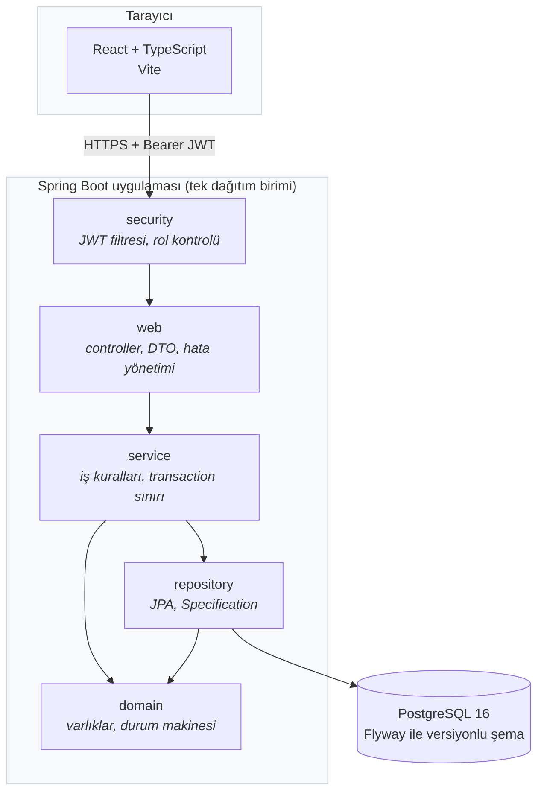
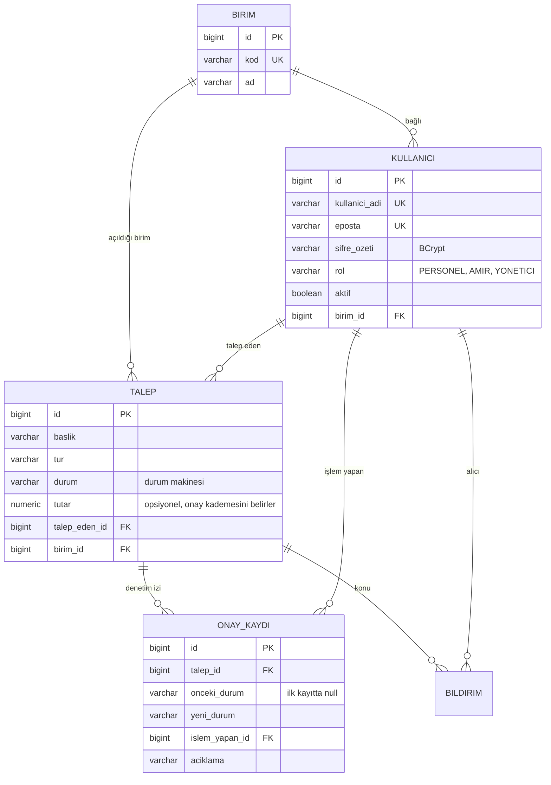
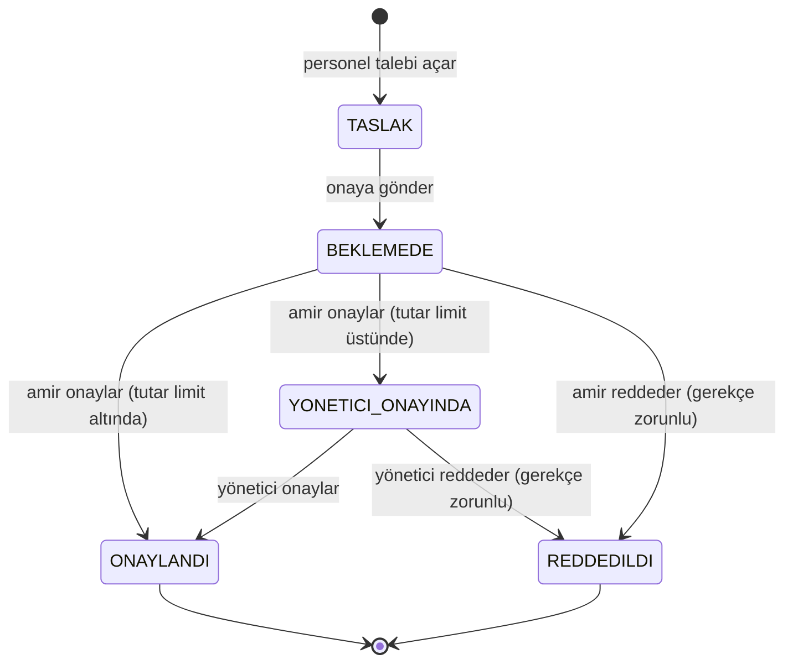
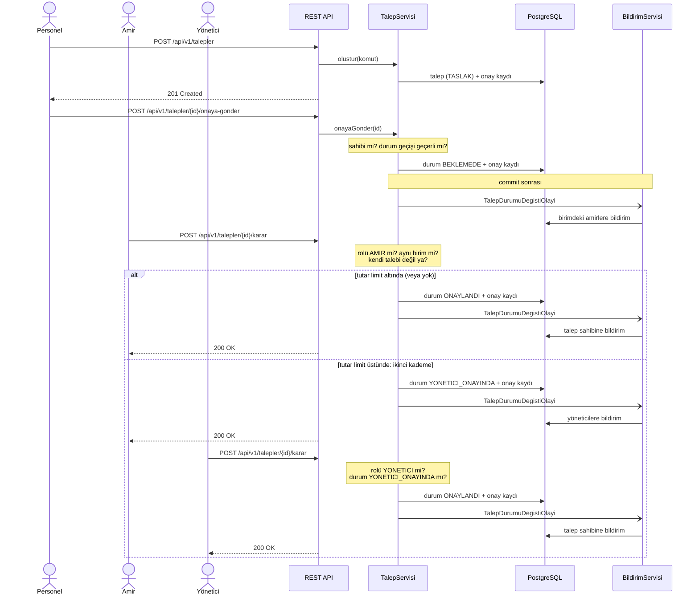

# Kurumsal Talep ve Onay Yönetim Sistemi

[](https://github.com/ebraronuk/talep-onay-sistemi/actions/workflows/ci.yml)

Personel talep açar, birim amiri onaylar veya reddeder, her durum değişikliği silinemez bir denetim kaydına yazılır, ilgili kişiye bildirim düşer, yönetici özet raporu görür.

Spring Boot 3.5 · Java 21 · PostgreSQL 16 · Spring Security (JWT) · React + TypeScript · Docker · GitHub Actions

**202 test yeşil** (182 arka uç, 20 ön yüz). Performans iddiaları ölçüldü, çıktıları [docs/performans.md](docs/performans.md) içinde. Mimari kararlar gerekçeleri ve reddedilen alternatifleriyle [docs/decisions.md](docs/decisions.md), katman kuralları ve nesne tasarımı [docs/mimari.md](docs/mimari.md) içinde.

---

## Beş dakikada ayağa kaldırma

Tek gereksinim Docker.

```bash
git clone https://github.com/ebraronuk/talep-onay-sistemi.git
cd talep-onay-sistemi
docker compose up --build
```

Hazır olduğunda:

| Adres | Ne |
|---|---|
| http://localhost:8080/swagger-ui.html | API dokümanı, uçlar buradan denenebilir |
| http://localhost:8080/actuator/health | Sağlık kontrolü |

Ön yüzü ayrıca çalıştırmak için:

```bash
cd frontend && npm install && npm run dev
```

http://localhost:5173 adresinde açılır ve `/api` isteklerini arka uca yönlendirir.

### Demo hesapları

Uygulama `demo` profiliyle açıldığında örnek veri yüklenir. Hepsinin şifresi `Parola123!`:

| Kullanıcı | Rol | Ne yapabilir |
|---|---|---|
| `ayse.yilmaz` | PERSONEL | Kendi talebini açar, onaya gönderir, yalnızca kendi taleplerini görür |
| `ali.vural` | AMIR | BTGM birimindeki talepleri onaylar veya reddeder |
| `hakan.ozturk` | YONETICI | Tüm birimleri ve özet raporu görür; tutar limitini aşan taleplerde ikinci kademe onayı verir |

Denemeye değer akış: `ayse.yilmaz` ile giriş yapıp talep açın ve onaya gönderin, sonra `ali.vural` ile girip onaylayın. Talep detayındaki onay geçmişi her adımı kimin ne zaman yaptığıyla birlikte tutar.

İki kademeli onayı görmek için: demo verisinde `mehmet.demir`'in açtığı "Sunucu yenileme" talebi (120.000 TL) `ali.vural` onayından geçmiş ve `hakan.ozturk`'ün ikinci kademe onayını bekliyor durumda gelir. `hakan.ozturk` ile giriş yapıp o talebi sonuçlandırabilirsiniz.

---

## Mimari



Katman kuralları ArchUnit ile teste bağlı (bkz. [docs/mimari.md](docs/mimari.md)):

- **Controller'da iş mantığı yok.** Görevi HTTP ile servis arasında çeviri yapmak.
- **Entity dışarı çıkmıyor.** Yanıtlar DTO, istekler doğrulama anotasyonlu komut record'ları.
- **Transaction sınırı servis katmanında.** Controller'da olsaydı HTTP işi transaction'a girerdi; repository'de olsaydı tek bir iş kuralı birden çok transaction'a bölünürdü.
- **`open-in-view: false`.** Spring Boot bunu varsayılan olarak açık getirir; açık bırakmak `LazyInitializationException`'ı gizlerken N+1 sorgularını görünmez yapar.

---

## Veri modeli



Her tabloda `olusturma_tarihi`, `guncelleme_tarihi`, `olusturan_kullanici` denetim alanları var; Spring Data JPA auditing tarafından dolduruluyor.

Şema Flyway migration dosyalarıyla elle yazıldı, Hibernate'e ürettirilmedi. `ddl-auto: validate` ayarı entity ile şema birbirinden ayrıldığında uygulamayı açılışta durdurur.

---

## Durum makinesi



İzin verilen geçişler tek bir yerde, `TalepDurumu` enum'unda tanımlı. Tanımsız her geçiş `GecersizDurumGecisiException` fırlatır ve HTTP 409 döner. 25 geçiş kombinasyonunun (5×5 durum matrisi) tamamı ayrı ayrı test edilmiş.

Hangi dala gidileceğini talebin `tutar` alanı belirliyor: yapılandırılabilir bir limitin (`talep.onay.yonetici-limiti`, bkz. `OnayAyarlari`) üstündeki talepler, birim amiri onayından sonra ayrıca yönetici onayına düşer. Tutarı olmayan talepler (izin gibi) her zaman tek kademede biter. Kimin hangi kademede karar verebileceği hem `@PreAuthorize` hem de servis katmanında ayrıca kontrol edilir: bir amir ikinci kademeye, bir yönetici de birinci kademeye karışamaz.

Durum değişikliği ve denetim kaydı **aynı transaction içinde** yazılır: denetim kaydı yazılamazsa talebin durumu da değişmez. Bu davranış teste bağlı, bkz. `TalepServisiTransactionTest`.

İki amir (veya iki yönetici) aynı talebe aynı anda karar verirse ikincisi 409 alır. `Talep` varlığında `@Version` kolonu var (iyimser kilitleme); bu olmadan ikinci yazım birincinin üzerine sessizce geçer ve denetim izinde iki çelişkili kayıt kalırdı.

---

## Onay akışı uçtan uca



Bildirim yazımı ana işlemden **ayrı bir transaction'da**, commit sonrasında çalışır. Bildirim yazılamazsa onay geri sarmaz: onay iş açısından asıl olan, bildirim yan etki. Karar ve gerekçesi: [decisions K-011](docs/decisions.md).

---

## Ölçülen sayılar

Aşağıdaki her sayı gerçek bir çalıştırmadan alındı. Ham çıktılar [docs/performans.md](docs/performans.md) içinde.

| Ne ölçüldü | Sonuç | Sınır |
|---|---|---|
| `docker compose up` → tüm servisler sağlıklı | 9 sn | 60 sn |
| N+1 sorgu (10 talep + ilişkileri) | **11 sorgu → 1 sorgu** | N+1 olmayacak |
| Listeleme sorgusu planı (50.000 kayıt) | `Bitmap Index Scan`, 0,87 ms | sequential scan olmayacak |
| Aynı sorgu, indeks kapalı | `Seq Scan`, 3,15 ms, 49.375 satır elendi | karşılaştırma |
| Sayfalı listeleme (1000 kayıt, repository) | medyan 2 ms | 200 ms |
| Okuma p95 (50 eşzamanlı, HTTP uçtan uca) | 64,2 ms | 200 ms |
| Yazma p95 (50 eşzamanlı) | 91,1 ms | 400 ms |
| Okuma verimi | 1505 istek/sn | - |
| Bellek (boşta, RSS) | 331 MB | 512 MB |
| Servis katmanı satır kapsamı | %92,9 | %85 |
| Proje geneli satır kapsamı | %90,0 | %80 |
| Mutasyon skoru (iş mantığı sınıfları) | %92-100 | - |

Yük testini kendiniz çalıştırmak için (uygulama `demo` profiliyle ayaktayken):

```bash
node scripts/yuk-testi.mjs
```

---

## Testler

```bash
./mvnw clean verify          # arka uç: 182 test + biçim denetimi + kapsam eşiği
cd frontend && npm test      # ön yüz: 20 test
```

| Tür | Adet | Ne kanıtlıyor |
|---|---|---|
| Saf birim (Spring yok) | 60 | Durum makinesi (iki kademe dahil) ve iş kuralları |
| Mimari (ArchUnit) | 10 | Katman kuralları yorum değil, test |
| Repository (gerçek PostgreSQL) | 26 | Sorgular, tembel yükleme, kısıtlar, N+1 |
| HTTP katmanı (`@WebMvcTest`) | 13 | Status kodları, doğrulama |
| Hata sözleşmesi | 6 | Çerçeve hataları da aynı gövdeyi döner |
| Güvenlik entegrasyonu | 33 | Gerçek filtre zinciriyle her rol × her uç |
| İki kademeli onay (uçtan uca) | 4 | Tutar limitine göre ikinci kademeye düşme; HTTP'den denetim izine |
| Transaction, kilitleme, bildirim | 8 | Rollback, iyimser kilit, commit sonrası olay |
| Korelasyon kimliği | 4 | İstek izlenebilirliği |
| Performans bekçisi | 1 | Sayfalama regresyona düşerse test kırılır |
| Denetim izi koruması | 3 | Trigger, SQL ile bile değişikliğe izin vermiyor |
| Varlık kimliği | 12 | `equals`/`hashCode` sözleşmesi, beş varlık için |
| Ön yüz (Vitest) | 20 | Giriş, talep oluşturma, iki kademeli onaylama akışları |

Testler gerçek PostgreSQL üzerinde çalışır (Testcontainers). H2 kullanılmadı: kısmi indeks, `TIMESTAMPTZ` davranışı ve kısıt hata kodları farklı olduğu için H2'de yeşil olup üretimde patlayan test üretme riski var.

Üç test özellikle bekçi görevinde:

- **`UcKorumaTest`** uygulamanın kendi uç listesini `RequestMappingHandlerMapping` üzerinden okur ve her birini token'sız dener. Yarın biri yeni bir controller metodu ekleyip güvenlik kuralını yazmayı unutursa bu test kırmızıya döner.
- **`MimariKurallariTest`** katman kurallarını ArchUnit ile zorlar. Yazıldığı gün iki gerçek döngüsel bağımlılık yakaladı; ikisi de derlenen, testleri geçen koddu.
- **`TalepListelemePerformansTest`** `@EntityGraph` kaldırılırsa ya da indeks düşerse süre sınırını aştığı için kırılır.

### Derlemeyi kıran diğer kurallar

| Kural | Araç | Eşik |
|---|---|---|
| Biçim ve kullanılmayan import | Spotless | ihlal varsa `validate` fazında kırılır |
| Satır kapsamı, proje geneli | JaCoCo | %80 |
| Satır kapsamı, servis paketi | JaCoCo | %85 |
| Ön yüz lint | oxlint | uyarı toleransı sıfır |

Yerelde biçim düzeltmek için: `./mvnw spotless:apply`

**Mutasyon testi** ayrı profilde: `./mvnw -Pmutasyon test`. Satır kapsamı "bu satır çalıştı" der, "doğru çalıştı" demez. İlk çalıştırma gerçek bir test boşluğu buldu; detay [docs/performans.md](docs/performans.md) bölüm 6.

---

## Güvenlik

Uçların tam yetki tablosu, sızdırmama kuralları ve doğrulanan saldırı senaryoları: [docs/guvenlik.md](docs/guvenlik.md)

Özet:

- Kimlik doğrulama imzalı JWT ile, sunucuda oturum tutulmaz.
- Yetkilendirme iki kademeli: controller'da rol (`@PreAuthorize`), serviste kayıt bazlı ("bu talep senin mi, senin biriminde mi").
- Şifreler BCrypt ile saklanır; JWT anahtarının uzunluğu açılışta doğrulanır.
- Kullanıcı adının sistemde kayıtlı olup olmadığı ne hata mesajından ne de yanıt süresinden anlaşılır.
- Doğrulanan senaryolar arasında en kritiği: **başka bir anahtarla imzalanmış, rolü `YONETICI` yazan token 401 alır.**

---

## Kapsam dışı bırakılanlar

Bu liste kasıtlı ve dokümante. "İleride lazım olur" diye eklenen hiçbir şey yok:

| Ne yok | Neden yok |
|---|---|
| Mikroservisler | Tek tutarlılık sınırı var, tek transaction yetiyor |
| Kafka / RabbitMQ | Bildirim yan etki, uygulama içi olay yeterli |
| Redis | Stateless JWT, paylaşılacak oturum yok |
| Spring State Machine / Camunda | Dört durum, dört geçiş; bir enum yeterli |
| Redux | Paylaşılan tek durum "kim giriş yapmış"; Context yeterli |
| Soft delete, versiyonlama tablosu | Denetim izi zaten `onay_kaydi` tablosunda |
| Çok kiracılı yapı | Tek kurum varsayımı |
| Dosya eki, e-posta, SMS | Kapsam dışı |

Her birinin gerekçesi ve reddedilen alternatifi [docs/decisions.md](docs/decisions.md) içinde on üç karar başlığı altında yazılı.

---

## Proje yapısı

```
.
├── src/main/java/tr/ebrar/talep/
│   ├── domain/          varlıklar, durum makinesi, denetim alanları
│   ├── repository/      JpaRepository, Specification, projeksiyonlar
│   ├── service/         iş kuralları, transaction sınırları, DTO çevrimi
│   ├── security/        JWT üretimi ve doğrulaması, güvenlik yapılandırması
│   ├── web/             controller, hata yönetimi, korelasyon kimliği
│   └── config/          JPA auditing, OpenAPI, demo verisi
├── src/main/resources/db/migration/   Flyway şema dosyaları
├── src/test/java/       182 test (mimari kuralları dahil)
├── frontend/            React + TypeScript + Vite
├── scripts/yuk-testi.mjs
├── docs/
│   ├── decisions.md     mimari kararlar: karar, gerekçe, reddedilen alternatif
│   ├── mimari.md        katman kuralları, nesne tasarımı, SOLID, kod standartları
│   ├── performans.md    ölçüm çıktıları
│   └── guvenlik.md      uç yetki tablosu ve saldırı senaryoları
├── docker-compose.yml
└── Dockerfile
```

---

## Gözlemlenebilirlik

- `/actuator/health` ve `/actuator/info` açık; diğer actuator uçları `YONETICI` rolüne kapalı.
- Her isteğe korelasyon kimliği takılır, `X-Korelasyon-Kimligi` başlığıyla geri döner ve tüm log satırlarına yazılır. İstemci kendi kimliğini gönderirse o korunur, böylece ön yüz ve arka uç logları eşleşir.
- Şifre ve token hiçbir log satırına yazılmaz.

```
2026-08-26 22:42:54.011  INFO [8de086d1] tr.ebrar.talep.service.TalepServisi : Talep durumu degisti: id=7, BEKLEMEDE -> ONAYLANDI, islem yapan=ali.vural
```

---

## Üretime çıkarken

Bu bir portföy projesi. Gerçek bir kuruma konulacaksa yapılacaklar [docs/guvenlik.md](docs/guvenlik.md) sonunda maddeler halinde: gizli anahtar yönetimi, Swagger'ın kapatılması, CORS listesinin daraltılması, HTTPS zorunluluğu, giriş denemelerine hız sınırlama.
